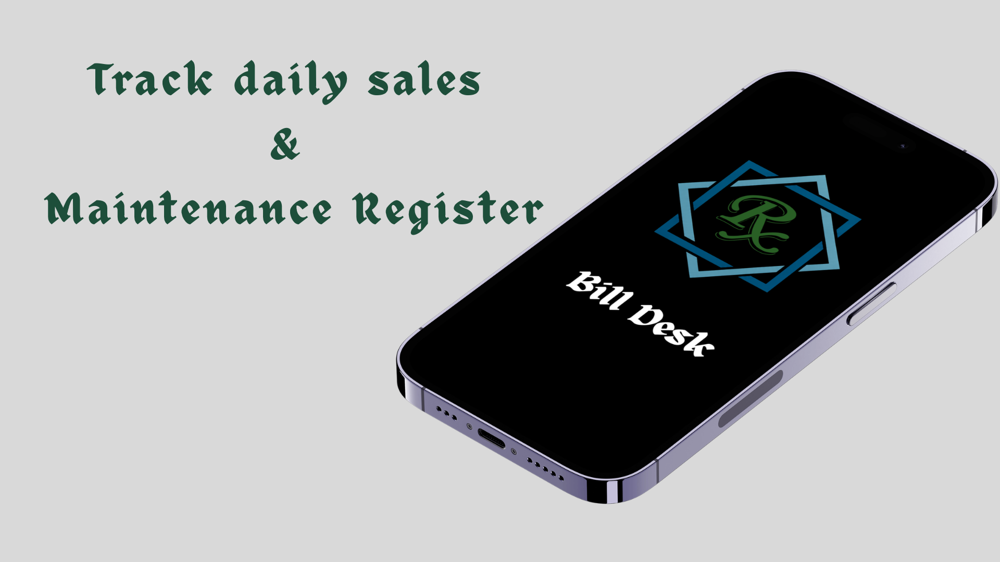
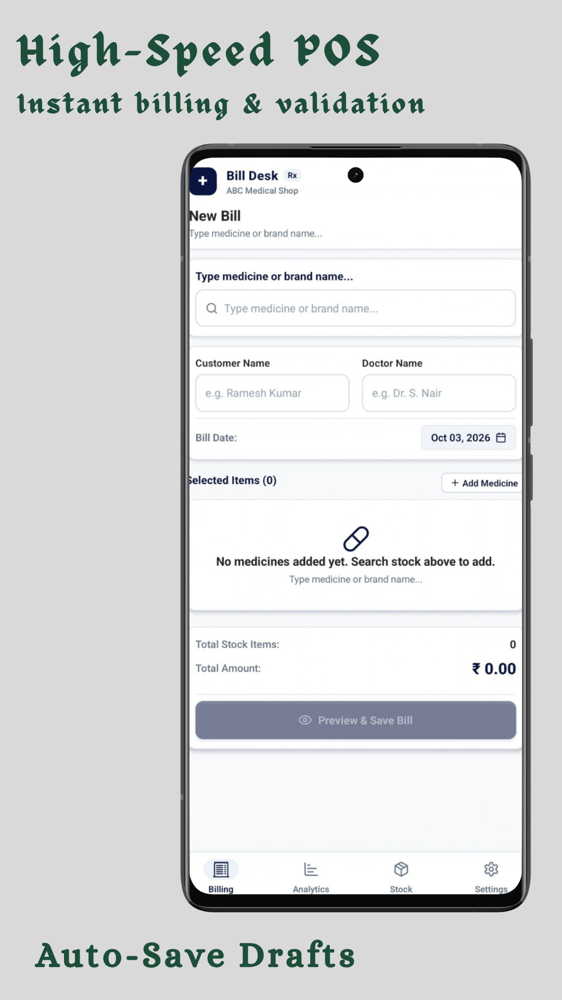
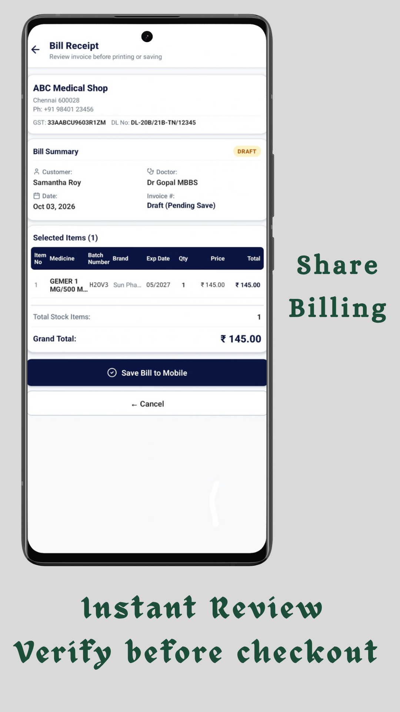
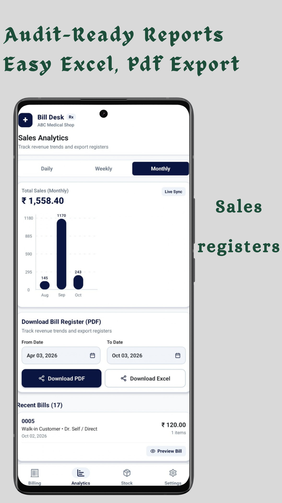
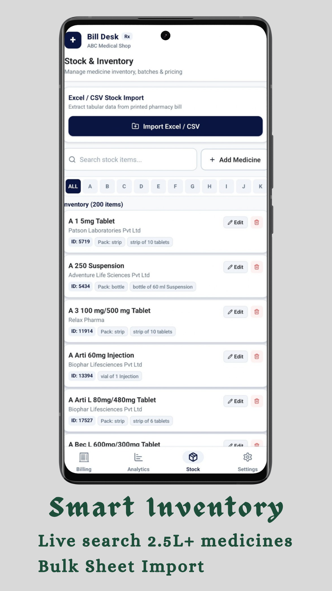
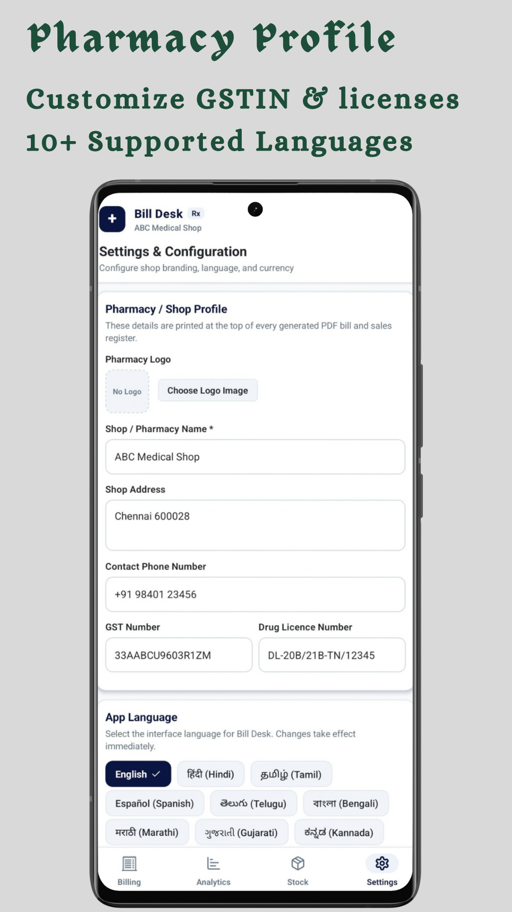

# Bill Desk - Pharmacy Register Maintenance & Billing App

**Bill Desk** is an offline-first mobile application designed specifically for **retail pharmacies, medical shops, and chemists**. It provides high-speed Point-of-Sale (POS) billing and maintains statutory, audit-ready drug sales registers compliant with pharmacy regulatory standards.

Built with **React Native (Expo SDK 52)**, **TypeScript**, **Zustand**, and a local **SQLite database**, the app operates **100% offline** on the device with zero internet dependency, zero latency, and complete patient data privacy.

<p align="center">
  
</p>

---

## 📥 Download Android APK

A ready-to-install production Android package is included directly in this repository:

* **[⬇️ Download Bill Desk.apk](https://github.com/acdeena1994/BILL_DESK/raw/refs/heads/main/Bill%20Desk.apk?download=)** *(Direct APK File — `Bill Desk.apk`)*


> **Installation Steps**:
> 1. Click the link above to download **`Bill Desk.apk`** (or copy it from the repository root folder to your Android phone).
> 2. Open the downloaded `.apk` file on your Android device.
> 3. If prompted, allow installation from unknown sources and tap **Install**.

---

## 📱 App Screenshots

<table align="center">
  <tr>
    <td align="center" width="33%">
      <br />
      <b>High-Speed POS Billing</b><br />
      <sub>Instant search, cart & auto-save drafts</sub>
    </td>
    <td align="center" width="33%">
      <br />
      <b>Bill Review & Receipt</b><br />
      <sub>Verify before checkout & share via PDF</sub>
    </td>
    <td align="center" width="33%">
      <br />
      <b>Sales Analytics & Registers</b><br />
      <sub>Audit-ready PDF & Excel statutory reports</sub>
    </td>
  </tr>
</table>

<table align="center">
  <tr>
    <td align="center" width="50%">
      <br />
      <b>Smart Inventory Management</b><br />
      <sub>2.5L+ pre-loaded medicines & Excel/CSV bulk import</sub>
    </td>
    <td align="center" width="50%">
      <br />
      <b>Pharmacy Profile & Multi-Language</b><br />
      <sub>Configure GSTIN, Drug License No & 17 languages</sub>
    </td>
  </tr>
</table>

---

## 🚀 Features (Implemented in this App)

### 1. Medical & Statutory Sales Register Maintenance
* **Audit-Ready Register**: Generates regulatory drug sales registers recording **Bill No, Date, Doctor Name, Customer/Patient Name, Medicine Name, Quantity, Batch Number, Brand Name, Expiry Date, Price, and Pharmacist Signature Line**.
* **Date-Range Filtering**: Filter sales records by Quick Presets (Today, Last 7 Days, Last 6 Weeks, Last 6 Months) or a custom **From Date – To Date** picker.
* **Vectorized PDF Register Export**: Generates multi-page, formatted PDF registers containing the pharmacy header (Shop Name, Address, Phone, GSTIN, Drug License Number) and table for physical filing and inspection.
* **Excel (.xlsx) Export**: Exports complete register workbooks for tax filing, audits, and accounting software.
* **Visual Revenue Analytics**: Interactive sales trends bar charts (Daily 7 Days, Weekly 6 Weeks, Monthly 6 Months) powered by `react-native-gifted-charts`.
* **Invoice History Drilldown**: Inspect full line items, doctor name, and customer details of past bills.

### 2. High-Speed POS Billing
* **250,000+ Medicine Search**: Instant indexed autocomplete searching across 2.5 Lakh+ pre-loaded medicines by brand, medicine name, or manufacturer.
* **Dynamic Cart Editing**: Inline modification of quantity, batch number, expiry date (`MM/YY` format with validation), and decimal unit prices.
* **Ad-Hoc Custom Items**: Add uncataloged or new medicines directly from the billing screen without leaving the sale.
* **Prescription & Patient Tracking**: Record customer/patient name and prescribing doctor name per invoice.
* **Draft Autosave & Crash Recovery**: Monitors background state and automatically preserves in-progress bills in `AsyncStorage`. If interrupted or closed, the app prompts to resume the draft on launch.
* **Bill Review Screen**: Verify invoice items, taxes, quantities, and totals before committing.
* **Atomic ACID Checkout**: Writes bill records, line items, and stock deductions inside a single atomic SQLite transaction (`db.withTransactionAsync`).
* **Dual Invoice Sharing**:
  * **Thermal / A4 PDF Invoice**: Generate and share vectorized PDF receipts featuring shop logo, GSTIN, and Drug License No.
  * **WhatsApp Receipt**: One-tap formatted plain text bill sharing directly through native share sheet.

### 3. Inventory & Stock Management
* **Pre-bundled 250,000+ Medicine Catalog**: Bundled 66 MB SQLite database installed locally on device startup.
* **A–Z Alphabet Quick Filter**: Instant alphabetical navigation (`ALL`, `A` to `Z`) combined with live text search.
* **Manual Stock Management**: Add new items or edit existing inventory fields: Product ID, Batch Number, Brand, Manufacturer, Pack Unit, Expiry Date, Price, and Quantity.
* **Bulk Catalog Import**: Import supplier stock sheets from `.xlsx`, `.xls`, `.csv`, or `.json` files.
* **Import Sandbox Archiving**: Automatically creates secure backup copies of imported catalog files in the device sandbox (`stock/imports/`).

### 4. Pharmacy Profile & Settings
* **Shop Identity**: Set Pharmacy Name, Address, Contact Number, GSTIN, and statutory **Drug License Number (DL No)**.
* **Custom Pharmacy Logo**: Upload shop logo via image picker; rendered automatically onto PDF receipts.
* **Multi-Currency**: Select from standard currencies (`₹`, `$`, `€`, `£`, `AED`, `¥`) or enter a custom symbol.
* **Real-Time Database Health**: Live counter displaying SQLite database file size, total bills recorded, and stock items count.
* **One-Click Backup & Restore**: Export timestamped SQLite `.db` backups (with WAL checkpoint) to Google Drive or local storage; restore existing backup files with schema verification.
* **Bill Counter Reset**: Confirmation-protected reset option to restart bill numbering from 0 without deleting existing bills.

### 5. Multi-Language Support (17 Languages)
Switch dynamically without restarting the app:
* **English**,  **தமிழ் (Tamil)**, **हिन्दी (Hindi)**, **తెలుగు (Telugu)**, **বাংলা (Bengali)**, **मराठी (Marathi)**, **ગુજરાતી (Gujarati)**, **ಕನ್ನಡ (Kannada)**, **മലയാളം (Malayalam)**, **ਪੰਜਾਬੀ (Punjabi)**, **ଓଡ଼ିଆ (Odia)**, **অসমীয়া (Assamese)**, **اردو (Urdu)**, **नेपाली (Nepali)**, **कोंकणी (Konkani)**, **کٲشُر (Kashmiri)**, and **Español (Spanish)**.

---

## 🛠️ How to Execute the Code

### Prerequisites
* **Node.js**: v18.x or v20.x LTS ([Download Node.js](https://nodejs.org/))
* **Java Development Kit (JDK)**: JDK 17 installed and `JAVA_HOME` environment variable configured.
* **Android Studio**: Android SDK (API Level 33 or 34) and build-tools installed.
* **Device / Emulator**: Physical Android phone with USB Debugging enabled, or an Android Virtual Device (AVD).

---

### Step 1: Install Dependencies
Open a terminal in the project root directory and run:
```bash
npm install
```

---

### Step 2: Run Development Build

#### Option A: Run Directly on Android (Recommended)
This compiles the native Android module with the bundled SQLite database and launches it on your connected device/emulator:
```bash
npm run android
```
*(Alternative: `npx expo run:android`)*

#### Option B: Start Metro Bundler
```bash
npm start
```
* Press `a` in the terminal to launch on your connected Android device/emulator.
* Press `r` to reload the bundle.

#### Option C: Web Preview (Component / UI Testing)
```bash
npm run web
```

---

### Step 3: Run Validation & Integrity Tests
```bash
# Check TypeScript types without emitting code
npm run ts:check

# Run decimal price handling & calculation verification
npm test

# Verify WhatsApp and PDF bill formatting logic
node scripts/verify_billing_share_format.mjs
```

---

## 📦 How to Build and Download the APK

### Pre-Built APK (Ready to Install)
* **Direct Download**: [**`Bill Desk.apk`**](./Bill%20Desk.apk) *(located in the project root directory)*
* **Install via ADB**:
  ```bash
  adb install -r "Bill Desk.apk"
  ```

You can also rebuild the installable `.apk` file from source using **Local Offline Build** (Gradle) or **Expo Cloud Build** (EAS).

---

### Method 1: Local Offline Build via Gradle (Direct APK)

This builds the APK locally on your machine inside the `android/` directory without requiring any cloud subscription.

#### 1. Build Debug APK (For fast testing)
Run in the project root:
```bash
npm run build:apk:debug
```
*(Runs: `cd android && gradlew assembleDebug`)*

* **Generated APK Path**:
  ```
  android/app/build/outputs/apk/debug/app-debug.apk
  ```

#### 2. Build Release APK (Optimized production build)
Run in the project root:
```bash
npm run build:apk
```
*(Runs: `cd android && gradlew assembleRelease`)*

* **Generated APK Path**:
  ```
  android/app/build/outputs/apk/release/app-release.apk
  ```

#### 3. Install the APK to your Phone
* **Via USB**: Connect your phone to your PC, copy `Bill Desk.apk`, `app-debug.apk`, or `app-release.apk` to your phone's **Downloads** folder, and tap to install.
* **Via ADB**:
  ```bash
  adb install -r android/app/build/outputs/apk/debug/app-debug.apk
  ```

---

### Method 2: Cloud Build via Expo EAS (Direct Download Link & QR Code)

EAS compiles the APK on Expo cloud servers and provides a direct download link and QR code to download straight to your mobile device.

1. **Install EAS CLI and Log In**:
   ```bash
   npm install -g eas-cli
   npx eas login
   ```

2. **Trigger the APK Build**:
   ```bash
   npx eas build -p android --profile preview
   ```
   *(The `preview` profile in `eas.json` is pre-configured to output a standalone `.apk`)*

3. **Download the APK**:
   * When the build completes (typically 3–5 minutes), EAS prints a **direct download URL** and a **QR Code** in your terminal.
   * Scan the QR code with your phone camera or open the URL in your mobile browser to download and install the APK directly.

---

## 📂 Project Structure

```
Bill Desk/
├── App_Screenshot/                      # App preview banners & screen showcase images
│   ├── Overview.png
│   ├── Billing.png
│   ├── preview.png
│   ├── Analytics.png
│   ├── Stock.png
│   └── setting.png
├── android/                             # Android native Gradle configuration & build files
├── assets/                              # App icons, splash screens, and pre-bundled 66MB SQLite DB
│   ├── billdesk.db                      # 2.5L+ pre-loaded medicine catalog
│   ├── icon.png
│   └── splash.png
├── scripts/                             # Verification tests & DB generator scripts
├── src/
│   ├── components/                      # Reusable UI components (AppHeader, Input, Button, Modals)
│   ├── db/                              # SQLite queries (bills, stock, settings) & schema
│   ├── localization/                    # i18n setup & translations for 17 languages
│   ├── navigation/                      # Bottom tab navigation & Root stack
│   ├── screens/
│   │   ├── Analytics/                   # Statutory Register Maintenance, PDF/Excel export, Charts
│   │   ├── Billing/                     # POS Billing, Medicine search, Cart, Preview, PDF/WhatsApp Share
│   │   ├── Stock/                       # Inventory catalog, A-Z filter, Manual entry, Excel/CSV import
│   │   ├── Settings/                    # Pharmacy profile, DL No, GSTIN, Backup & Restore
│   │   ├── Onboarding/                  # First-run guide & language selector
│   │   └── Splash/                      # Boot & local database initializer
│   ├── services/                        # Draft autosave service & SQLite WAL backup service
│   ├── store/                           # Zustand stores (useBillingStore, useStockStore, useSettingsStore)
│   └── utils/                           # Formatters, PDF generator, Excel generator/parser
├── App.tsx                              # App entry point & AppState draft listeners
├── Bill Desk.apk                        # Pre-built installable Android APK package
├── app.json                             # Expo app configuration
├── eas.json                             # EAS Build configuration (APK profile)
└── package.json                         # Scripts & dependencies
```

---


